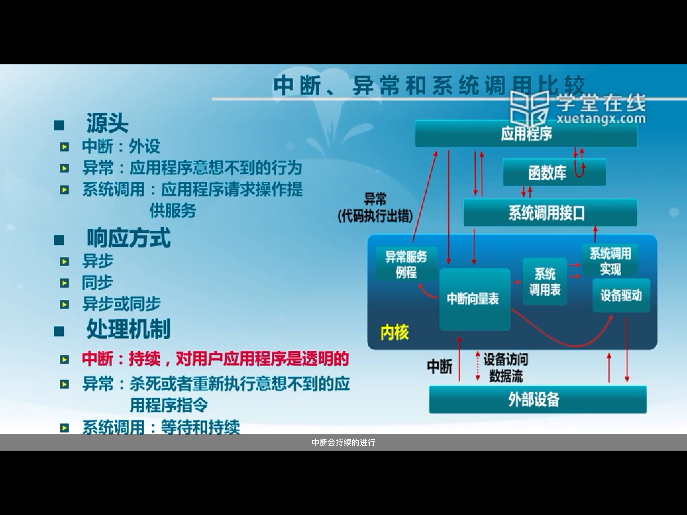
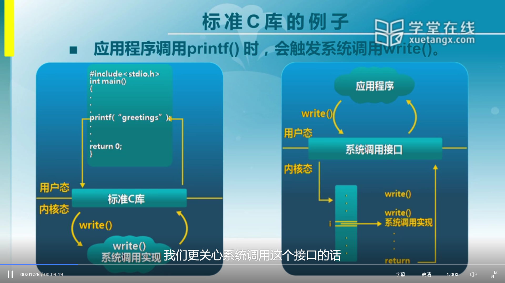

##### • 你理解的对于类似ucore这样需要进程/虚存/文件系统的操作系统，在硬件设计上至少需要有哪些直接的支持？至少应该提供哪些功能的特权指令？
进程的切换需要硬件支持时钟中断；虚存管理需要地址映射机制，从而需要MMU等硬件；对于文件系统，需要硬件有稳定的存储介质来保证操作系统的持久性。 对应的，应当提供中断使能，触发软中断等中断相关的，设置内存寻址模式，设置页表等内存管理相关的，执行I/O操作等文件系统相关的特权指令。
对于现代操作系统（每个进程占一个时间片）时钟中断是非常需要的。存储介质当然也是非常必要的。当然，事实上，MMU没有也行，可以用用户态函数库来实现地址转换，但这样可能就保证不了安全性了。
Intel手册第3卷2.8节“System Instruction Summary”中给出了一个系统指令列表。“系统指令完成的是系统级的功能，包括加载系统寄存器、管理Cache、管理中断和设置调试寄存器。其中的大部分指令都必须由操作系统或特权级为0的进程执行；另一部分可以由任何特权级的进程执行。”

##### • 你理解的x86的实模式和保护模式有什么区别？你认为从实模式切换到保护模式需要注意那些方面？
保护模式和实模式的根本区别是进程内存是否受保护。（实模式既是一个历史包袱，又有一定的实际用途。在实模式下，BIOS自检和加载bootloader的程序可以尽可能简单，因为不需要建立复杂的段映射。但是段机制必须开启这一点也是历史包袱。总之，bootloader一开始就开了A20，设置了GDT然后长跳转切换到保护模式了。）实模式将整个物理内存看成分段的区域，程序代码和数据位于不同区域，系统程序和用户程序没有区别对待，而且每一个指针都是指向“实在”的物理地址。这样一来，用户程序的一个指针如果指向了系统程序区域或其他用户程序区域，并改变了值，那么对于这个被修改的系统程序或用户程序，其后果就很可能是灾难性的。为了克服这种低劣的内存管理方式，处理器厂商开发出保护模式。这样，物理内存地址不能直接被程序访问，程序内部的地址（虚拟地址）要由操作系统转化为物理地址去访问，程序对此一无所知。

##### • 物理地址、线性地址、逻辑地址的含义分别是什么？它们之间有什么联系？
- 物理地址：是处理器提交到总线上用于访问计算机系统中的内存和外设的最终地址。
- 逻辑地址：在有地址变换功能的计算机中，访问指令给出的地址叫逻辑地址。（一般的定义是段选择子+段内偏移量是逻辑地址。大概）
- 线性地址：线性地址是逻辑地址到物理地址变换之间的中间层，是处理器通过段(Segment)机制控制下的形成的地址空间。

##### • Q：应用程序能直接调用内核的函数吗？说明原因，举个例子。
**• A**：需要系统调用来访问内核函数。
- **库函数**，常见的有 libc、glibc 等是运行在用户态上，为程序员提供的一套对系统调用或用户态功能的封装，以 libc 为例，也就是我们通常说的 C 标准库，里面有 printf() 等函数。库函数作为一种应用程序接口，它的作用主要体现在以下两方面：
	1. 隐藏了 Linux/Unix 内核的实现，降低了应用层程序员们开发和学习编程的门槛。
	2. 对应用层开发者们隐藏了不同机器硬件上的差异，有助于编写出可移植性更强的应用程序。
   
    不过值得注意的是，一般来说，我们通过下面这条路径来达到访问系统调用，陷入内核态的目的：
**应用程序 -> 库函数 -> 系统调用**
但这并非绝对，应用程序并不是一定非要通过库函数这一层来访问系统调用，而是可以跳过去，直接访问系统调用从而达到陷入内核态的目的：
**应用程序 -> 系统调用**

但这样编写出来的程序可移植性就差了点，毕竟每个操作系统所提供的 System Call 都是有差别的，即便支持了 POSIX（Portable Operating System Interface）也难以例外。
除此之外，我们还应该意识到，libc 和 System Call 之间的关系并不是严丝合缝的（举例），称不上是一种严格的封装：一个 libc 函数并不一定对应操作系统上的一条 System Call。反之，一个 libc 函数可能对应当前操作系统上的多条系统调用，甚至是零条系统调用。
举几个例子，比如说 read() 接口，它刚好和 read 系统调用一一对应。但是到了 malloc() 和 free() 接口这里情况就不一样了，malloc() 和 free() 接口都需要用到 brk 系统调用来扩大或缩小进程的堆（多对一），而最令你奇怪的可能当属 abs()、strcmp() 这样的接口了，由于它们不需要使用内核所提供的任何服务，因此也没有使用任何一个系统调用，调用它们不会陷入内核态。
来自 <http://zhangshen147.online/post/system-call> 

**Q: 除了基于页表的地址空间隔离，请问还能想到其他的地址空间隔离方式吗？**
**A：**
分段(Segmentation)：这种方法是人们最开始使用的一种方法，基本思路是将程序所需要的内存地址空间大小的虚拟空间映射到某个物理地址空间。
每个程序都有自己的独立虚拟的进程地址空间。进程的只能看到自己的虚拟地址空间，这就使得进程和实际的物理地址解除耦合。两块大小相同的虚拟地址空间和实际物理地址空间一一映射，即虚拟地址空间中的每个字节对应于实际地址空间中的每个字节，这个映射过程由软件来设置映射的机制，实际的转换由硬件来完成。

来自 <https://www.jianshu.com/p/f4e0c802ade9> 

**Q：中断/异常有何区别？如果没有中断机制，应用程序/操作系统要如何与外设进行交互？**
**A：**
• 中断：外部意外的响应；
• 异常：指令执行意外的响应；
• 系统调用：系统调用指令的响应。

来自 <https://blog.csdn.net/weixin_41376979/article/details/83756975> 

• 系统调用（system call）：应用程序主动向操作系统发出的服务请求
• 异常（exception）：非法指令或其他原因导致当前指令执行失败（如：内存出错）后的处理请求
• 中断（hardware interrupt）：来自硬件设备的处理请求
它们的相同之处是，采用的处理方式大致相同。无论是发生异常、中断，还是系统调用，都需要由硬件保存现场和中断号，转到内核态，进入中断向量表，查找对应的设备驱动程序地址（异常）、异常服务例程地址（异常），或找到系统调用表，并在其中查找对应的系统调用实现的起始地址。处理完毕之后，再进行现场的切换，回到用户态继续执行程序（如果可以继续的话）。

来自 <https://blog.csdn.net/weixin_41376979/article/details/83756975> 

**Q：你是如何理解和描述OS与APP的交互接口？**
**A** :系统调用。
系统调用（System Call）接口是操作系统(OS)内核与上层应用进程(APP)进行交互通信的唯一接口
通过这个接口，用户可以访问OS内核空间，具体步骤：用户地址空间APP->系统调用->OS->OS内核->返回用户空间。用户APP通过直接或者间接（库函数）调用中断int0X80，并在eax寄存器中指定系统调用功能号，即可使用内核资源包括硬件资源。例如很多情况下，APP都是使用具有标准接口定义下的C函数库中的函数间接地使用内核的系统调用

**Q：你是如何理解和描述OS与CPU的交互接口？**
**A**：
- The CPU just runs instructions from memory starting at some offset and then keeps fetching the next instruction and repeating. The bootloader sets up the CPU to start running the OS entry point when your computer starts. Actions like keyboard or mouse input cause interrupts which the interrupt controller use to lookup special code setup by the OS to handle these interrupts. These interrupts are also used to allow the OS to switch which thread is currently running on the CPU using special privileged instructions that can only be run in kernel mode. The interrupt causes the CPU to switch to kernel mode before calling into the OS interrupt handler code so that the OS can use the necessary privileged instructions for controlling various behavior user mode code is not allowed to.

来自 <https://stackoverflow.com/questions/23857542/how-does-an-os-communicate-with-the-cpu/23857668> 

- CPU calls OS for specific tasks using interrupts, and OS uses special privileged CPU registers to program CPU.
For example, when you press key on keyboard, interrupt is generated by hardware. CPU calls interrupt handler function (it is part of OS), which will handle keypress and, for example, pass it into user program.
Other example of frequent OS-CPU interaction is task switching. Most OS uses hardware timer to generate around 100 timer interrupts every second. On this interrupt OS scheduler is called, and sometimes it can switch tasks by changing some CPU registers. In simplest OS & CPUs, scheduler will change SP (stack pointer) and PC (program counter) register. With more complex CPUs it will also reprogram MMU hardware unit of CPU and change many internal control registers.
External hardware usually programmed by drivers by doing PIO writes or writes to mapped PCI space (writes to special addresses of hardware memory).

**Q：请说出你知道的特权指令或特权寄存器（x86/arm/mips/risc-v）**
**A**:
    1）允许和禁止中断，控制中断禁止屏蔽位
      2）在进程间切换处理
      3）存取用于主存保护的寄存器
      4）执行I/O操作
      5）停止一个中央处理器的工作
      6）清理内存
      7）设置时钟
      8）建立存储键
      9）加载PSW

来自 <https://blog.csdn.net/frozenshore/article/details/48739009> 
特权指令只能在cpu的特权模式下使用。这些指令只留给内核使用，用户无法直接使用特权指令。

https://blog.csdn.net/drshenlei/article/details/4265101

- Certain registers are privileged, that is, they can be accessed or modified only in privileged mode (Ring 0 or CPL=0) or these registers can be accessed or modified under specific privilege level. A few examples are as follows:
FLAGS register (EFLAGS: 32-bit, RFLAGS: 64-bit): This register has many flags. We will refer to following in our examples:
	Interrupt enable or IF flag (one bit) that controls enabling or disabling of maskable interrupts (see below). If the IF is set to 1, an maskable interrupt can interrupt the processor, if 0, it cannot. 
	IO privilege level (IOPL) flag (2 bits). A task or program (T1) can access IO ports if its current privilege level (CPL) is less than or equal to IOPL. A program or task may get access privilege to a port via the IO bitmap. The POPF (POPF: 16 bit, POPFD: 32 bit or POPFQ: 64-bit architecture) instruction pops the top of the stack into the privileged FLAGS register, as a result of which the IOPL and the IF flags can be modified. The IOPL can only be modified by the POPF and IRET instructions when CPL is 0. A program can modify the IF flag, only if its CPL is less than or equal to the IOPL.
Control registers are privileged registers. A few examples are as follows:
	The CR0 register can be used to enable or disable certain processor features, such as protected mode to turn on virtual addressing and memory paging.
	The CR2 register is loaded with the address of memory location from where execution will resume when a page fault occurs.
	The CR3 register is loaded with an address pointing to the root of memory page directory, which is used to walk page tables to locate a memory page.
	Debug registers DR0-7.
IO registers: These are registers or memory on IO devices or ports, such as the PCIe [REF] BAR (base address register). These registers are privileged. 

来自 <https://sites.google.com/site/masumzh/articles/x86-architecture-basics/x86-architecture-basics> 

- The CPU Instructions are categorized as non-privileged, privileged, sensitive and privileged without exceptions as follows:
	- Non-privileged Instructions: CPU instructions that do not have to be run in privileged mode. For example, a MOV (move one operand to another) instruction that does not operate on a privileged register, such as the ones described above.
	- Privileged instructions are instructions that can only be executed at CPL of 0. Any attempt to execute these instructions at less privilege level will result in general protection (#GP) exception or fault (see below for definition). Following are a few examples of privileged instructions:
		- HLT: Halt CPU till next interrupt.
		- INVLPG: Invalidate a page entry in the translation look-aside buffer (TLB).
		- LIDT: Load Interrupt Descriptor Table.
		- MOV CR registers: load or store control registers. In this case the MOV instruction (a non-privileged instruction on its own) is accessing a privileged register.
		- RDMSR, WRMSR: Read / write model specific registers (MSR).

    - Sensitive Instructions: These are instructions that are IOPL sensitive. These instructions can only be executed when CPL <= IOPL. Otherwise a GP exception will result.
	CLI: Clear interrupt by setting the IF bit of the FLAGS register to 0 (clear the IF bit). When cleared maskable external interrupts (see below for definition) are ignored (not handled). The clearing has no effect on exceptions and non-maskable interrupts or NMI (see below), which are handled even if this bit cleared.
	STI: Set interrupts by setting the IF bit of the FLAGS register to 1. In this case maskable external interrupts are handled after the next instruction. It has no effect on exceptions and NMI.
	Privileged IO instructions to access IO ports (Port-mapped IO): These instructions are used to access IO ports through a separate IO address space. These are privileged instructions
		IN / OUT: move data between I/O ports and a CPU register (RAX/EAX register). The address of the I/O port can be an immediate operand or contained in the EDX/RDX register. The other instructions are INS and OUTS to move string data between an IO port and memory.
	Privilege instructions without exception:
		POPF and IRET instructions to modify IOPL: These instructions can change the IOPL flag only if they are executed at CPL=0. An attempt to execute these instructions at CPL > 0 to change the IOPL is simply ignored and no exception is generated.
POPF to modify IF: A program can modify the IF flag by executing the POPF instruction if the program’s CPL <= IOPL. Any attempt by a less privileged program is simply ignored and no exception is generated.  